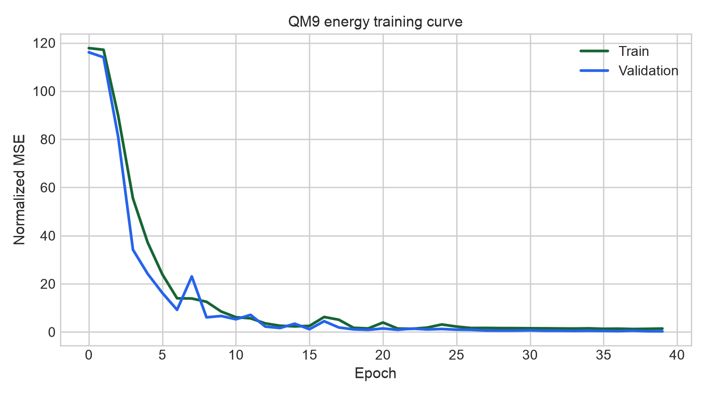
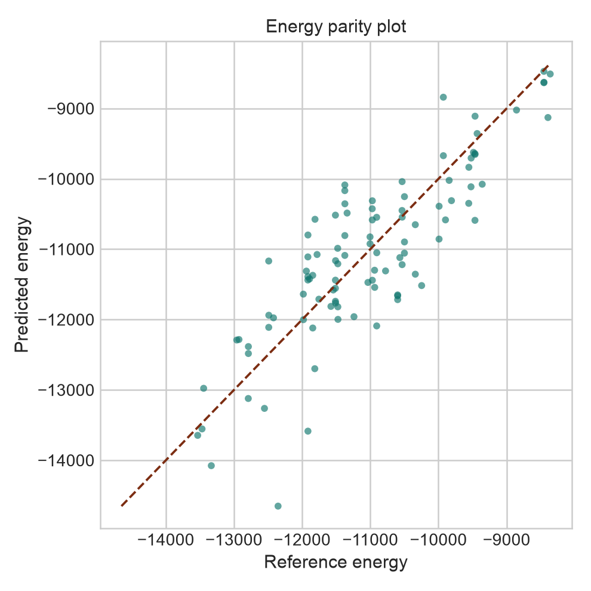
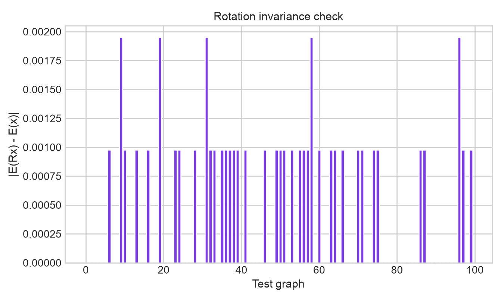

# E3NN QM9 Energy Model

This project now focuses on the simpler and cleaner first milestone:

> Predict a QM9 molecular energy target directly from the built-in QM9 labels using an equivariant graph network built with `e3nn` tensor products and `torch_geometric` message passing.

The current default target is `U0`, the QM9 internal energy at 0 K.

## Core idea

Instead of generating new force labels with PySCF, this version uses the energy labels already present in QM9 and builds an equivariant network around them:

- node inputs come from atomic identities
- edge geometry comes from relative 3D displacement vectors
- message passing uses `e3nn.o3.FullyConnectedTensorProduct`
- only scalar (`0e`) information is read out at the end
- graph energy is the sum of per-node scalar energy contributions

That keeps the project aligned with geometric deep learning while making the first working version much easier to train and evaluate.

## Dataset

The local `torch_geometric.datasets.QM9` loader reports:

- total graphs: `130831`
- built-in targets per molecule: `19`
- current target index: `7`
- current target name: `U0`

To keep iteration fast, the current training run uses a small subset:

- train: `500`
- validation: `100`
- test: `100`

## Architecture

### Node representation

Each atom starts from an embedding on the scalar part of the node irreps.

Current hidden node irreps:

```text
32x0e + 8x1o
```

So each node carries:

- scalar channels (`0e`) that are invariant under rotation
- vector channels (`1o`) that transform equivariantly under rotation

### Edge representation

Each edge uses geometry from the relative displacement vector:

- radial information from edge length
- angular information from spherical harmonics

Current edge attribute irreps:

```text
1x0e + 1x1o
```

There is also a learned scalar edge state produced from a radial basis expansion of the edge length.

### Custom message passing layer

`TensorProductMessagePassing` does the following:

1. use the source node feature irreps and edge attribute irreps in an `e3nn.o3.FullyConnectedTensorProduct`
2. generate tensor-product weights from the learned edge feature vector
3. aggregate messages at the destination node
4. apply a self linear map and residual update to node features
5. update the learned edge feature state using scalar node information from the source and destination

This gives a real tensor-product-based equivariant layer, instead of a plain MLP pretending to be geometric.

### Graph-level readout

At the end:

- only the scalar node channels are sent into the energy head MLP
- each node contributes one scalar energy
- graph energy is the sum across nodes in the same batch graph

That scalar-only readout is important: vector irreps should not be summed into the final energy because energy must be rotation-invariant.

## Repository layout

```text
src/
  train.py
  egnn_qm9/
    config.py
    data.py
    model.py
    training.py
    plotting.py
    pipeline.py
docs/
  figures/
data/
  raw/
  processed/
```

## Run

Prepare the subset split metadata:

```bash
python src/train.py prepare-data
```

Train and write metrics/figures:

```bash
python src/train.py train
```

Run the whole flow:

```bash
python src/train.py full-pipeline
```

## Current run snapshot

Current checked-in run:

- target: `U0`
- train/val/test: `500 / 100 / 100`
- energy MSE: `451266.72`
- energy MAE: `537.55`
- energy R²: `0.6888`
- rotation-invariance MAE: `0.000439`

These are still early results, but they are much more meaningful than the earlier force experiment because:

- the target is directly supervised from QM9
- the equivariant structure is explicit
- the invariance check is already close to zero

## Result figures

### Training curve

The training and validation losses both come down substantially over the 40-epoch run, which is a good sign that the tensor-product message-passing stack is learning a useful scalar energy signal even from a very small subset.



### Energy parity plot

The parity plot compares predicted graph energies against the QM9 reference values on the held-out test split. It is not perfect yet, but the predictions already track the overall trend well enough to produce a positive `R^2`.



### Rotation invariance check

This figure checks a basic physical sanity condition for scalar energy prediction: rotating the input geometry should not materially change the predicted energy. The very small error values here show that the model is behaving close to invariant in practice.



## Generated artifacts

The project writes:

- metrics: `docs/metrics.json`
- training curve: `docs/figures/training_curve.png`
- energy parity plot: `docs/figures/energy_parity.png`
- rotation invariance plot: `docs/figures/rotation_invariance.png`

## Why this version makes sense

This is a better first portfolio milestone than the earlier force-generation version because it isolates the geometric learning problem:

- no expensive external label generation
- direct use of a standard benchmark dataset
- real `e3nn` tensor-product message passing
- clear invariant scalar readout
- fast enough to iterate on architecture choices

Once this is stronger, the natural next step is to scale the subset size up and then consider adding force prediction back in as an energy-gradient extension.
